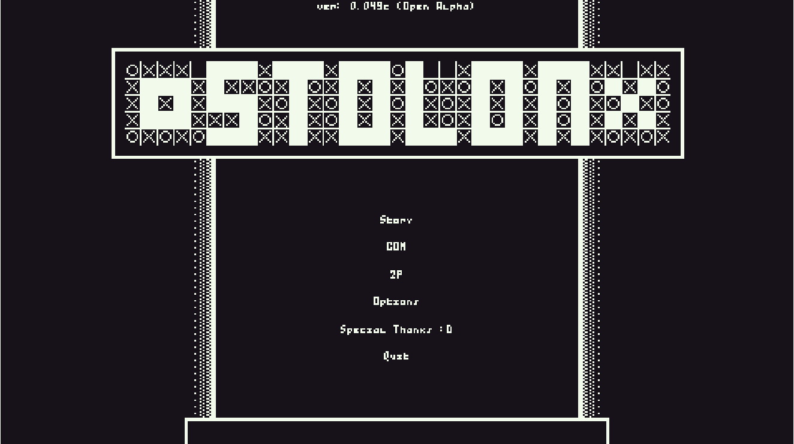
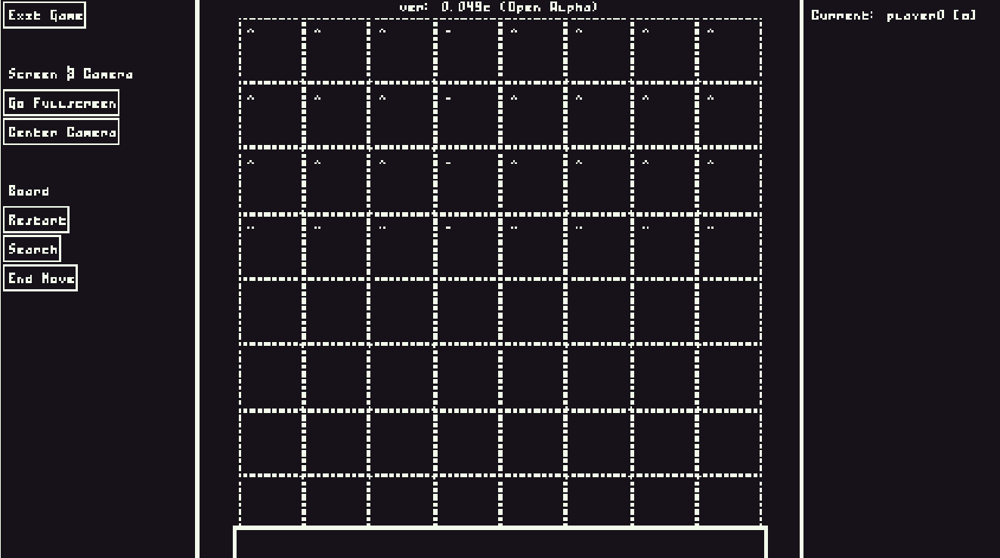
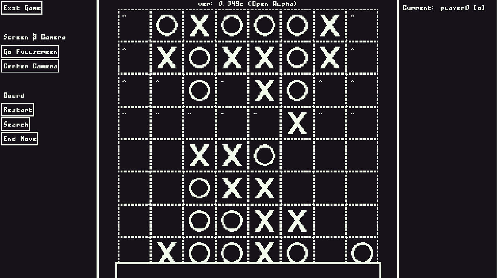
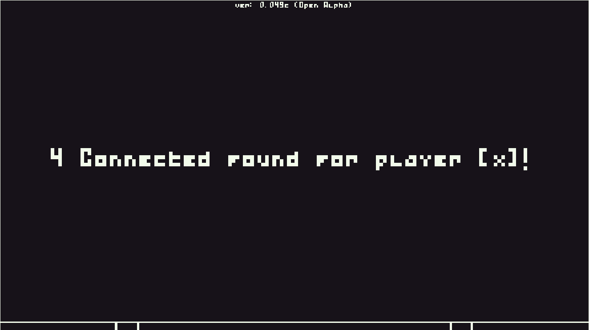

> [!WARNING]
> This is the PRE-0.051 README. There are major differences between _v0.051_ and _v0.050_. For more info read the [main README](../README.md).

<h1 align="center">STOLON</h1>

<h4 align="center">A game that alters the classic "Four in a Row / Connect Four" formula to the point of being unrecognizable.</h4>

> [!NOTE]
> For planned features see the [STOLON Discord Server](https://discord.gg/qmuWrqbDG2).

# Screenshots

The menu.

The board, top 4 layers have inverted gravity applied to them.

The board once more.

The transition screen after four connected are found.

# Install

Download the newest release from ["Releases"](https://github.com/JTnadrooi/Stolon/releases/) or the [STOLON Discord Server](https://discord.gg/qmuWrqbDG2) and extract the **STOLON.zip** file. There an .exe will be found which will run the game.

> [!IMPORTANT]
> Without .Net8 the game will not start and immidiatelly close.

# Game Info

## Controls

| Key             | Action                 |
| --------------- | ---------------------- |
| F               | Go full-screen         |
| Left Mouse      | Place marker / Zoom in |
| Right Mouse     | Zoom out / Drag camera |
| Shift           | Zoom in                |
| Shift + W/A/S/D | Move camera            |

## Buttons (In Board)

| Button         | Action                                      |
| -------------- | ------------------------------------------- |
| Exit game      | Exit game                                   |
| Go full-screen | Go full-screen                              |
| Restart        | Clear board / Restart                       |
| Search         | Search the board for four connected markers |
| Undo move      | Undo's a move                               |
| End move       | Skips a move                                |

# Special thanks

| Entity     | For                                                                                       |
| ---------- | ----------------------------------------------------------------------------------------- |
| Keescasual | Coming up with a lot of the future ideas. Without him, this game probably wouldn't exist. |
| LandronSC  | Providing constructive feedback.                                                          |
| yukiyo     | Providing constructive feedback, especially with the entity/character designs!            |
| Voxuuu     | Utmost critical feedback.                                                                 |

_And thank you for playing :D_

## P.S

> [!NOTE]
> When the itch.io page is up, this will have more info about the technical side of the game (making it mostly directed to modders.)
